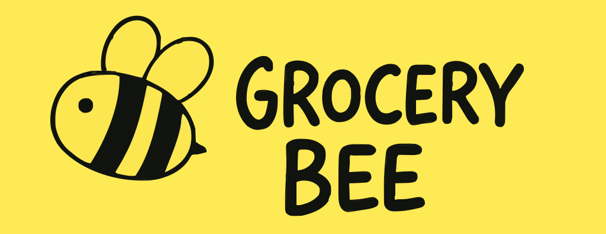

# Grocery Bee 🛒

  

Grocery Bee is a full-stack e-commerce web app for an online grocery store, built with the **MERN stack**. Users can browse, search, and buy groceries through a responsive interface.

## 📸 Screenshots
![Homepage]

![Cart]🛒

---

